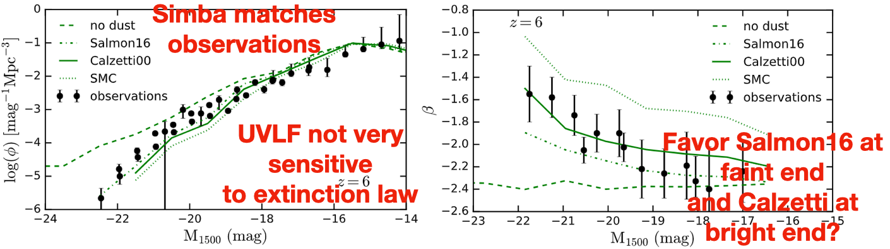
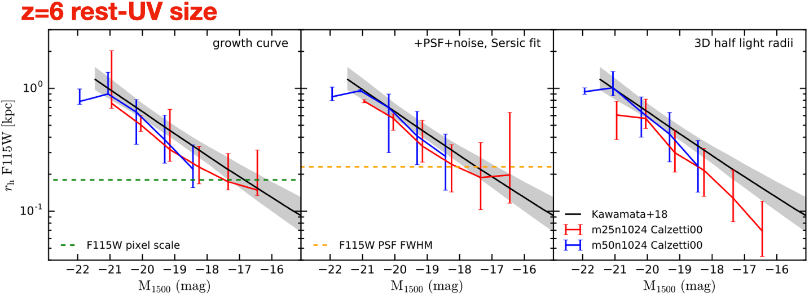
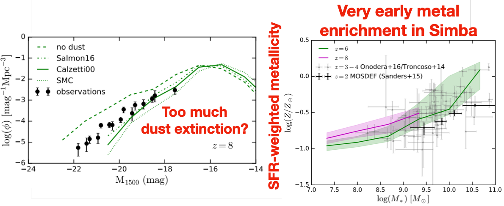
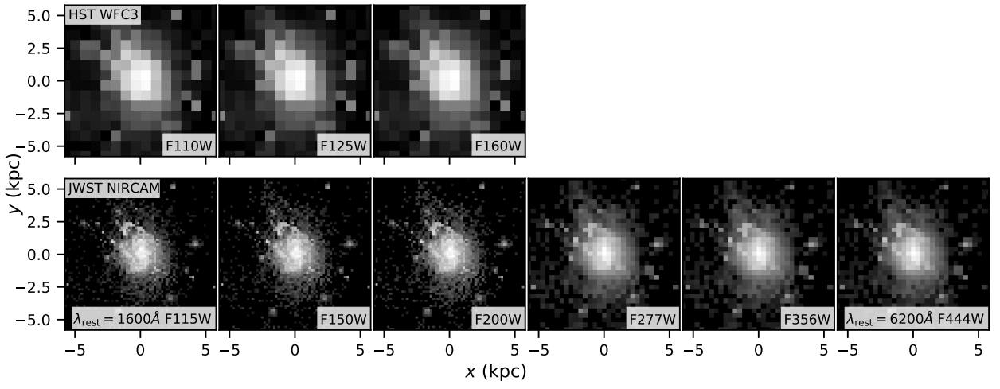

## Photometric properties of reionization-epoch galaxies in the Simba simulations

[ADS link](https://ui.adsabs.harvard.edu/abs/2020MNRAS.494.5636W/abstract)

Since galaxy formation simulations are calibrated using the low-redshift stellar mass function, it is crucial to examine whether the feedback models that reproduce the low-redshift observations are also able to match the high-redshift ones. Moreover, the simulated galaxies can be used to predict what we can observe with upcoming instruments such as JWST, and how future observations can help us constrain galaxy formation models in turn.

I therefore co-developed the publicly available [Pyloser](https://pyloser.readthedocs.io/en/latest/) code for creating mock observations out of simulations and used it on the redshift 6-8 galaxies in the Simba simulations. I found that while Simba roughly matches the observed UV properties of galaxies (Fig. 1), the early metal enrichment in Simba induces too much dust extinction that suppresses the number of bright galaxies. My finding indicates potential issues in Simba’s stellar feedback model at simulating high-redshift star formation. I also found that unlike the low-redshift galaxies, the simulated high-redshift galaxies produce similar rest-frame UV and optical properties owing to the young stellar populations. The predictions in my work have great implications for JWST as they will be testable with it.

<figure>
  
  
  <figcaption>Fig. 1: the simulated z=6 UVLF (top left), &beta;-M1500 relations (top right) assuming different extinction laws, and the rest-UV size-luminosity relations (bottom) with the galaxy size measured with three different methods.</figcaption>
</figure>

<!-- <figure> -->
<!--    -->
<!--   <figcaption>Fig. 2: the simulated z=8 UVLF (left) and gas-phase mass-metallicity relations at z=6 and 8 (right), which are actually higher than the z=2 observations.</figcaption> -->
<!-- </figure> -->

Finally, this paper is a show-off of Pyloser and our image generation routine. Fig. 2 shows the mock HST (top panels) and JWST (bottom panels) images of a simulated galaxy in Simba, without PSF and noise. The comparison is dramatic.

<figure>
  
  <figcaption>Fig. 2: mock HST and JWST images of a simulated galaxy in Simba, without PSF or noise effects.</figcaption>
</figure>

